<p align="center">
  
</p>

# MedConnect 🏥🎯

## Basic Details

### Team Name: THE FIXERS

### Team Members
- Member 1: Fathima Hudha PK - PPTM Arts & Science College, Cherur
- Member 2: Fasna Sherin - PPTM Arts & Science College, Cherur

### Hosted Project Link
[https://hudhafathima180-lab.github.io/tink-her-hack-temp/](https://hudhafathima180-lab.github.io/tink-her-hack-temp/)

### Project Description
MedConnect is a locality-based Hospital Doctors Management System that enables patients to check live availability status of doctors, book appointments with auto-generated tokens, and track their consultation queue in real-time.

### The Problem Statement
Patients often waste hours waiting at hospitals without knowing doctor availability, estimated wait times, or their position in the queue. There is no easy way to find nearby hospitals, compare doctors, or track live consultation status — leading to frustration and inefficiency for both patients and healthcare providers.

### The Solution
MedConnect solves this by providing a unified platform where patients can browse hospitals by locality, view doctor profiles with live availability, book appointments with auto-generated tokens, and track their token status in real-time. Doctors can manage their consultation queue digitally, and hospital admins can register and manage their staff — all from a single, mobile-friendly web interface with zero backend dependency.

---

## Technical Details

### Technologies/Components Used

**For Software:**
- **Languages used:** HTML5, CSS3, JavaScript (ES6+)
- **Frameworks used:** None (Vanilla — no frameworks for maximum portability)
- **Libraries used:** Google Fonts (Inter), DiceBear Avatars API (doctor profile photos)
- **Tools used:** VS Code, Git, GitHub Pages

---

## Features

- **Feature 1:** 📍 Locality-based hospital discovery — browse 10+ localities and view approved hospitals with doctor counts
- **Feature 2:** 👨‍⚕️ Doctor profiles with live availability — photo, specialization, consulting time, room number, and real-time online/offline status
- **Feature 3:** 🎫 Auto-generated token booking — enter patient details, receive token number with estimated wait time
- **Feature 4:** 📡 Live token tracking — real-time queue with color-coded statuses (🟢 consulting, 🟡 waiting, 🟣 booked) that auto-refreshes every 3 seconds
- **Feature 5:** 🩺 Doctor dashboard — manage today's bookings, start/complete/skip tokens with automatic queue advancement
- **Feature 6:** 🏥 Hospital admin panel — register hospitals, add/edit/delete doctors, toggle availability and booking status
- **Feature 7:** 👑 Super Admin module — system analytics, hospital approval/suspension workflow, locality management
- **Feature 8:** 🔐 Role-based authentication — 4 distinct user roles (Patient, Doctor, Hospital Admin, Super Admin)

---

## Implementation

### For Software:

#### Installation
```bash
# No installation required! Pure HTML/CSS/JS project.
# Simply clone the repository:
git clone https://github.com/hudhafathima180-lab/tink-her-hack-temp.git
cd tink-her-hack-temp
```

#### Run
```bash
# Option 1: Just open index.html in any browser
# Double-click index.html or:
start index.html        # Windows
open index.html         # macOS
xdg-open index.html     # Linux

# Option 2: Use any local server (optional)
npx serve .
# or
python -m http.server 8000
```

#### Demo Credentials
| Role | Email | Password |
|------|-------|----------|
| Patient | `patient@demo.com` | `demo` |
| Hospital Admin | `hospital@demo.com` | `demo` |
| Super Admin | `admin@demo.com` | `demo` |
| Doctor | *(auto-created)* | `demo` |

> 💡 **Tip:** Any email with password `demo` will auto-create an account for the selected role.
> To reset all data: open browser Console → `localStorage.clear()` → refresh.

---

## Project Documentation

### Screenshots

![Screenshot1 - Login Page][(screenshots/login.png](https://github.com/hudhafathima180-lab/tink-her-hack-temp/blob/main/Screenshot%202026-02-14%20184106.png?raw=true))
*MedConnect login page with dark glassmorphism theme, role-based authentication supporting Patient, Doctor, Hospital Admin, and Super Admin roles*

)
*Locality discovery grid showing 10 Bangalore localities with hospital counts — patients pick their area to find nearby hospitals*

)
*Doctor profile with live availability badge, specialization, consulting time, and one-click appointment booking with auto-generated token*

---

### System Architecture

```mermaid
graph TB
    A["🔐 Auth System"] --> B["👤 Patient Module"]
    A --> C["🩺 Doctor Module"]
    A --> D["🏥 Hospital Admin"]
    A --> E["👑 Super Admin"]
    
    B --> B1["📍 Locality Selection"]
    B1 --> B2["🏥 Hospital List"]
    B2 --> B3["👨‍⚕️ Doctor Profiles"]
    B3 --> B4["📝 Token Booking"]
    B4 --> B5["📡 Live Tracking"]
    
    C --> C1["📋 Today's Bookings"]
    C --> C2["🎫 Token Queue"]
    C --> C3["▶️ Active Consultation"]
    
    D --> D1["🏥 Hospital Registration"]
    D --> D2["👨‍⚕️ Doctor Management"]
    D --> D3["📅 Schedule View"]
    
    E --> E1["📊 Analytics Dashboard"]
    E --> E2["✅ Hospital Approvals"]
    E --> E3["📍 Locality Management"]
    
    F["💾 localStorage"] --> B
    F --> C
    F --> D
    F --> E
```



### Application Workflow


---

## Token Color Coding System

| Color | Status | Meaning |
|-------|--------|---------|
| 🟢 Green | `consulting` | Currently being seen by doctor |
| 🟡 Yellow | `waiting` | Waiting in queue |
| 🟣 Purple | `booked` | Booked but consulting hasn't started |
| ⚪ Gray | `completed` | Consultation finished |
| ~~Strikethrough~~ | `skipped` | Skipped by doctor |

---

## AI Tools Used (For Transparency)

**Tool Used:** Gemini (Antigravity AI Coding Assistant)

**Purpose:**
- Generated the complete frontend codebase (HTML, CSS, JavaScript)
- Designed the dark glassmorphism UI theme
- Implemented localStorage-based data persistence
- Created seed data for demo (hospitals, doctors, localities)

**Percentage of AI-generated code:** ~90%

**Human Contributions:**
- Project concept and requirements definition
- System architecture planning (modules, user flows)
- Feature prioritization and scope decisions
- Testing, deployment, and documentation
- UI/UX design direction and feedback

---

## Team Contributions

- **Fathima Hudha PK:** Project ideation, system architecture design, feature requirements, testing & deployment, documentation
- **Fasna Sherin:** UI/UX design direction, user flow planning, testing & QA, presentation

---

## License

This project is licensed under the MIT License - see the [LICENSE](LICENSE) file for details.

---

Made with ❤️ at TinkerHub
